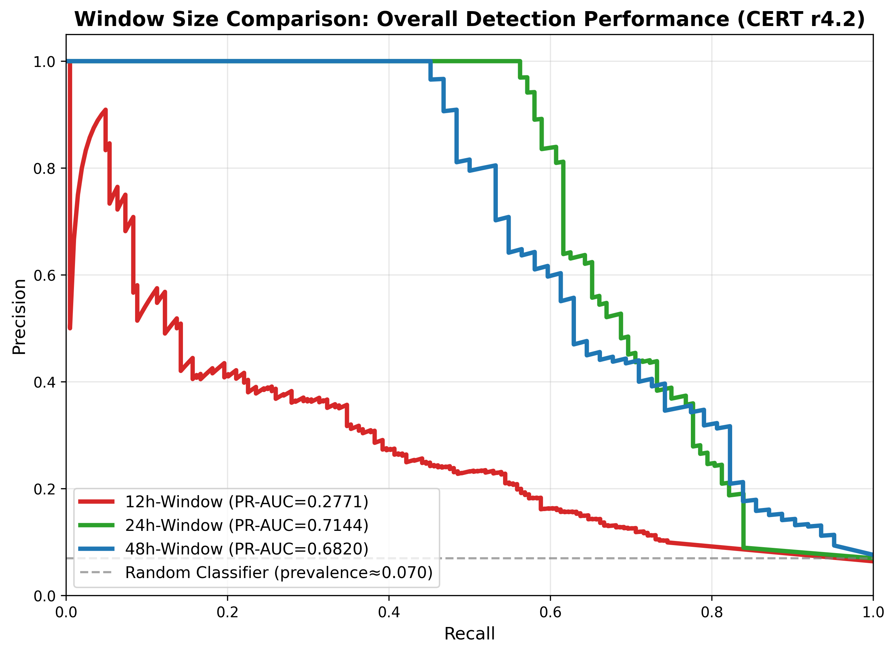

# UEBA Anomaly Detection: Window Ablation and Trajectory Detection

**Branch:** `feature/trajectory-detection` (created from `feature/window-size-ablation`)  
**Papers:** (1) Temporal Window Size Selection for CNN-Based Behavioral Anomaly Detection; (2) Trajectory-Level Insider Threat Detection via Top-k Aggregation

---

## Overview

This repository contains reproducible implementations for two related studies on User and Entity Behavior Analytics (UEBA):

1. **Window Size Ablation:** Optimal temporal window length for detecting insider threat attacks lasting 1-7 days.
2. **Trajectory-Level Detection:** Multi-day campaign detection via unified trajectory construction and top-k aggregation of window-level scores.

**Method:** CNN autoencoder with manifold learning, tested on CERT r4.2 insider threat dataset (compromised users only, temporal separation of train/test).

**Key Findings:**
- **24-hour windows** achieve optimal window-level performance (PR-AUC 0.714).
- **Top-2 mask aggregation** achieves trajectory-level PR-AUC 0.836 (vs 0.229 geodesic baseline); problem is aggregation-limited, not geometry-limited.

---

## Results Summary

| Window Size | Mask PR-AUC | Combined PR-AUC | ROC-AUC | Change vs 24h |
|-------------|-------------|-----------------|---------|---------------|
| **12-hour** | 0.277 | 0.282 | 0.736 | **-61%**  |
| **24-hour**  | **0.714** | 0.716 | 0.849 | **baseline**  |
| **48-hour** | 0.682 | 0.682 | 0.879 | **-4.5%**  |

**Interpretation:**
- 12h windows: Insufficient context, too noisy
- 24h windows: **Optimal balance** between context and granularity
- 48h windows: Excessive aggregation loses temporal precision

### Scenario-Specific Performance

| Window | Scenario 1 (Logon+Device) | Scenario 3 (Logon+Removable) |
|--------|---------------------------|------------------------------|
| 12h | 0.178 | 0.377 |
| 24h | **0.674** | **0.697** |
| 48h | 0.677 | 0.331  |

**Notable:** 48h windows show **53% degradation** for removable media exfiltration (Scenario 3), indicating these attacks require finer temporal resolution.

---

## Quick Start

### Prerequisites

```bash
# Python 3.8+ with dependencies
pip install torch numpy pandas scikit-learn scipy matplotlib

# CERT r4.2 Dataset (download from CMU)
# https://kilthub.cmu.edu/articles/dataset/Insider_Threat_Test_Dataset/12841247
# Extract to: data/cert/r4.2/
```

### Run All Three Experiments

```bash
# 12-hour windows (~15 min)
python examples/exp005_fixed_window_pipeline.py \
    --experiment exp013_12hour_lambda002_temp002 \
    --data-dir data/cert/r4.2 --window-hours 12 \
    --epochs 50 --use-mask-value --lambda-value 0.02 \
    --use-temporal-reg --lambda-temporal 0.02 --grid-search

# 24-hour windows (~10 min)  OPTIMAL
python examples/exp005_fixed_window_pipeline.py \
    --experiment exp012_lambda002_temp002 \
    --data-dir data/cert/r4.2 --window-hours 24 \
    --epochs 50 --use-mask-value --lambda-value 0.02 \
    --use-temporal-reg --lambda-temporal 0.02 --grid-search

# 48-hour windows (~8 min)
python examples/exp005_fixed_window_pipeline.py \
    --experiment exp014_48hour_lambda002_temp002 \
    --data-dir data/cert/r4.2 --window-hours 48 \
    --epochs 50 --use-mask-value --lambda-value 0.02 \
    --use-temporal-reg --lambda-temporal 0.02 --grid-search
```

**Total runtime:** ~35 minutes (sequential)

---

## Recreating the Trajectory Detection Experiment (exp015_unified_traj)

This experiment uses the same 24-hour window pipeline as above, with unified per-user trajectory construction and dual labeling (any-overlap, majority-overlap). It produces the trajectory-level baseline and supports the Phase 1 finding that top-k aggregation of window scores dramatically outperforms geodesic deviation.

### Step 1: Run exp015 (24h + unified trajectories)

From the repo root, with CERT r4.2 at `data/cert/r4.2`:

```bash
python examples/exp005_fixed_window_pipeline.py \
    --experiment exp015_unified_traj \
    --data-dir data/cert/r4.2 \
    --window-hours 24 \
    --epochs 50 \
    --use-mask-value --lambda-value 0.02 \
    --use-temporal-reg --lambda-temporal 0.02 \
    --traj-window-size 6 --traj-stride 3
```

**Runtime:** ~10–15 minutes (same order as 24h window ablation).

**Outputs in `runs/exp015_unified_traj/`:**
- `config.json` – experiment config (data_dir, window_hours, traj_window_size, traj_stride, etc.)
- `window_level_results.json`, `window_level_scores.npz` – window-level metrics and scores
- `trajectory_level_results.json`, `trajectory_level_scores.npz` – trajectory-level geodesic scores and labels
- Window-level PR-AUC ~0.70 (aligned with exp012). Trajectory-level geodesic baseline: any-overlap PR-AUC ~0.23, majority-overlap ~0.16.

### Step 2: Phase 1 aggregation (top-k vs geodesic)

After Step 1, run (no retraining; uses `data_dir` from `runs/exp015_unified_traj/config.json`):

```bash
python analyze_aggregation_scores.py
```

**Runtime:** ~2–3 minutes (loads CERT and recomputes trajectory–window mapping).

**Output:**
- `runs/exp015_unified_traj/phase1_aggregation_results.json` – PR-AUC and ROC-AUC for sum/mean/top2/top3 (mask_bce, ae_total, beta) and geodesic, for any-overlap and majority-overlap, plus per-scenario breakdown.

### Step 3: Trajectory PR curves (Scenario 1 and 3)

```bash
python plot_trajectory_pr_curves.py
```

**Runtime:** ~2–3 minutes (loads CERT and config from exp015).

**Outputs:**
- `runs/exp015_unified_traj/pr_curve_scenario1_top2.png`
- `runs/exp015_unified_traj/pr_curve_scenario3_top2.png`

**Expected trajectory metrics (from Phase 1):**
- **mask_bce_top2 (any-overlap):** PR-AUC 0.836, ROC-AUC 0.939.
- **Per scenario (top2):** Scenario 1 – PR-AUC 0.816, ROC-AUC 0.933; Scenario 3 – PR-AUC 0.794, ROC-AUC 0.989.

See **[TRAJECTORY_LAB_NOTEBOOK.md](TRAJECTORY_LAB_NOTEBOOK.md)** for methodology, Phase 0/1 results, and interpretation.

---

## Methodology

### Architecture

**CNN Autoencoder:**
- **Input:** (T, F) where T = temporal buckets (12, 24, or 48), F = 12 behavioral features
- **Encoding:** Spatial compression via strided convolutions  latent_dim=32
- **Decoding:** Symmetric upsampling via transposed convolutions
- **Loss:** Dual-channel (mask + value) with temporal smoothness regularization

### Key Techniques

1. **Dual-Channel Loss:**
   - **Mask channel:** Binary presence/absence (BCEWithLogitsLoss)
   - **Value channel:** Z-scored magnitude (masked MSE)
   - **Weight:** ?_value = 0.02 (minimal value regularization)

2. **Temporal Regularization:**
   - Penalty for large jumps between consecutive windows: ?_temporal * ||z_t+1 - z_t||?
   - Encourages smooth latent dynamics for normal behavior
   - **Weight:** ?_temporal = 0.02

3. **Chronological Split:**
   - Training: Temporally earlier normal windows (80%)
   - Testing: Later normal + all malicious windows (20% + attacks)
   - Prevents temporal leakage

4. **Reproducibility:**
   - PyTorch seed = 42
   - NumPy seed = 42
   - Deterministic data split

---

## Repository Structure

```
manifold-ueba/
 README.md                                    # This file
 WINDOW_SIZE_ABLATION_README.md               # Detailed replication guide (window ablation)
 TRAJECTORY_LAB_NOTEBOOK.md                   # Trajectory Phase 0/1 methodology and results
 analyze_aggregation_scores.py                # Phase 1: aggregation comparison (top-k, sum, mean)
 plot_trajectory_pr_curves.py                 # PR curves for Scenario 1 and 3 (top-2 mask)
 examples/
    exp005_fixed_window_pipeline.py           # Main experiment script
 manifold_ueba/
    cnn_model.py                              # CNN autoencoder (flexible architecture)
    data.py                                   # Dataset classes with temporal pairing
    latent_manifold.py                        # Manifold construction
    trajectory.py                             # Geodesic deviation scoring
    scoring.py                                # Anomaly scoring utilities
    etl/
        cert_fixed_window.py                  # CERT data loader (chronological split)
 runs/
     exp012_lambda002_temp002/                # 24h window ablation results
     exp013_12hour_lambda002_temp002/         # 12h window ablation results
     exp014_48hour_lambda002_temp002/        # 48h window ablation results
     exp015_unified_traj/                     # Trajectory experiment: config, *_results.json, *_scores.npz, phase1_aggregation_results.json, pr_curve_scenario*.png
     window_size_comparison_overall.png       # Window comparison plot (3 curves)
     window_size_comparison_all_scenarios.png # Detailed comparison (6 curves)
```

---

## Visualizations

### Overall Comparison



**Clean comparison showing 24-hour windows (green) significantly outperform 12-hour (red) and slightly outperform 48-hour (blue).**

### Scenario Breakdown

Individual PR curves by attack scenario available for each window size:
- [12-hour by scenario](runs/exp013_12hour_lambda002_temp002/pr_curve_by_scenario.png)
- [24-hour by scenario](runs/exp012_lambda002_temp002/pr_curve_by_scenario.png) 
- [48-hour by scenario](runs/exp014_48hour_lambda002_temp002/pr_curve_by_scenario.png)

---

## Key Contributions

1. **Systematic window size ablation** on real-world insider threat data (12h, 24h, 48h).
2. **Unified trajectory construction** (per-user chronological sequences, dual labeling) fixing miscalibrated baselines.
3. **Top-k aggregation** proving trajectory detection is aggregation-limited (PR-AUC 0.836 vs 0.229 geodesic); no curvature needed.
4. **Flexible CNN architecture** supporting variable temporal resolutions.
5. **Temporal consistency regularization** for improved latent representations.
6. **Scenario-specific analysis** and PR curves for publication (window ablation + trajectory).
7. **Complete reproducibility** with deterministic splits and seeding.

---

## Performance Details

### Window-Level Detection (Best: 24h)

**Experiment:** `exp012_lambda002_temp002`

| Metric | Value |
|--------|-------|
| **Mask PR-AUC** | **0.714** |
| **Combined PR-AUC** | 0.716 |
| **ROC-AUC** | 0.849 |
| **Precision** | 1.00 (zero false alarms) |
| **Recall** | 0.56 |
| **Best F1** | 0.72 |

**Operating point:** At optimal threshold, achieves **perfect precision** (no false positives) with 56% recall.

### Trajectory-Level Detection

**Window ablation (geodesic baseline):**

| Window Size | Trajectory PR-AUC | Trajectory ROC-AUC |
|-------------|-------------------|--------------------|
| 12h | 0.071 | 0.385 |
| 24h | **0.208** | 0.533 |
| 48h | 0.197 | 0.384 |

**Trajectory experiment (exp015 + Phase 1 top-k aggregation):**

| Method | Any-Overlap PR-AUC | Any-Overlap ROC-AUC | Scenario 1 PR-AUC | Scenario 3 PR-AUC |
|--------|--------------------|---------------------|-------------------|-------------------|
| mask_bce_top2 | **0.836** | **0.939** | 0.816 | 0.794 |
| mask_bce_top3 | 0.768 | 0.913 | 0.746 | 0.618 |
| geodesic (baseline) | 0.229 | 0.531 | 0.225 | 0.024 |

**Note:** Unified per-user trajectory construction (Phase 0) plus top-k aggregation of window-level mask scores (Phase 1) shows the trajectory task is aggregation-limited; no curvature or Riemannian metrics required. See [TRAJECTORY_LAB_NOTEBOOK.md](TRAJECTORY_LAB_NOTEBOOK.md).

---

## Experimental Controls

All experiments use **identical hyperparameters** except window size:

- **Architecture:** CNN autoencoder, latent_dim=32
- **Loss weights:** ?_value=0.02, ?_temporal=0.02
- **Training:** 50 epochs, batch_size=32, lr=0.001
- **Data:** CERT r4.2, chronological 80/20 split, 7-day attack buffer
- **Evaluation:** Grid search over ?/? combinations for optimal scoring

**Only variable:** `--window-hours` (12, 24, or 48)

---

## Dataset

**CERT Insider Threat Test Dataset r4.2**
- **Source:** Carnegie Mellon University
- **Size:** 32M+ events, 1000 users, 18 months
- **Attacks:** 70 compromised users, 26 with 1-7 day attack duration
- **Scenarios:** Logon+Device theft (16 users), Logon+Removable media (10 users)
- **Features:** 12 behavioral features (logon, device, HTTP, file, email)

---

## Documentation

- **[WINDOW_SIZE_ABLATION_README.md](WINDOW_SIZE_ABLATION_README.md)** - Complete replication instructions for window ablation (12h, 24h, 48h).
- **[TRAJECTORY_LAB_NOTEBOOK.md](TRAJECTORY_LAB_NOTEBOOK.md)** - Trajectory Phase 0/1 methodology, results, and interpretation (exp015, top-k aggregation).
- **Expected Outputs:** JSON results and PNG visualizations in `runs/` for both ablation and trajectory experiments.
- **No trained models:** Excluded due to size; reproducible via training script.

---

## Citation

If you use this work, please cite:

```bibtex
@article{cain2026window,
  title={Temporal Window Size Selection for CNN-Based Behavioral Anomaly Detection},
  author={Cain, Jericho},
  journal={[Journal TBD]},
  year={2026}
}
```

---

## Reproducibility Statement

This repository provides:
-  Complete source code
-  Exact hyperparameters
-  Deterministic data splits (chronological, seeded)
-  Pre-computed results (JSON + plots)
-  Step-by-step replication instructions
-  Expected outputs and runtimes

**Variation:** Results should be within ?2% PR-AUC due to hardware/library version differences. Data split and architecture are deterministic.

---

## Contact

For questions about this work, please open a GitHub issue or contact:
- Email: [your email]
- GitHub: [@jericho-cain](https://github.com/jericho-cain)

---

## License

MIT License - see LICENSE file for details.

---

**Last Updated:** February 2026  
**Status:**  Paper submission ready (window ablation + trajectory detection)  
**Branch:** `feature/trajectory-detection` (branched from `feature/window-size-ablation`)
